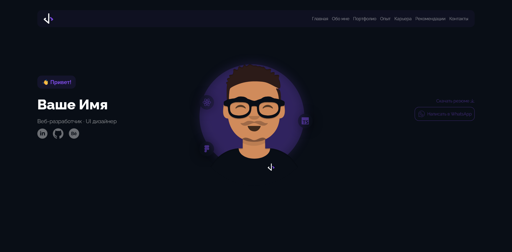

# Course project &laquo;API для сайта портфолио&raquo;

В данном проекте был реализован API на NodeJs c фреймворком Express. В реализации использовался паттерн MVC.

## Настройка перед работой

- Перед работой необходимо установить зависимости командой `npm install`
- Для запуска потребуются переменные окружения, которые устанавливаются в файле `.env` пример настройки приведен в файле `.env.example`
- Необходимо для переменной окружения `MONGODB_CONNECTION` установить значение вида `mongodb+srv://<логин>:<пароль>@<хост_базы_данных>/<имя_базы_данных>?retryWrites=true&w=majority`

##### Запуск проекта в режиме разработки`npm run dev`

##### Запуск проекта в production режиме `npm run start`

В приложении реализована авторизация через библиотеку [Passport.js](https://www.passportjs.org/)
по двум стратегиям логин/пароль и JWT токен
